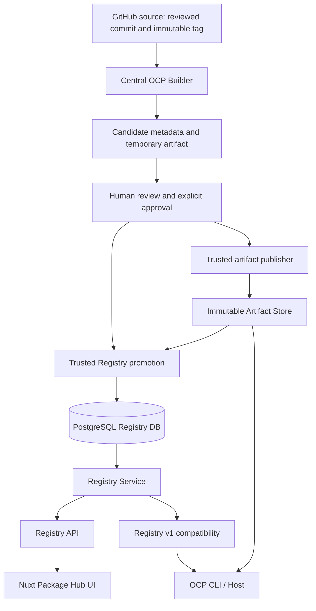

# ADR: Registry Service v2

## Status

Proposed for review in [#44](https://github.com/oklabflensburg/open-city-planner-packages/issues/44).
Acceptance of this ADR on merge makes its decisions binding for #45–#50. This PR
changes documentation only; Registry v1 remains the production authority until the
explicit migration gates below pass. Audit baseline: commit
`d54085286e5ed0d8df37715b6ed3fca465ee3dbb`.

Part of [#36](https://github.com/oklabflensburg/open-city-planner-packages/issues/36).
The implementation track is:

| Issue | Responsibility |
| --- | --- |
| [#44](https://github.com/oklabflensburg/open-city-planner-packages/issues/44) | Architecture and cross-component invariants (this ADR) |
| [#45](https://github.com/oklabflensburg/open-city-planner-packages/issues/45) | PostgreSQL domains, constraints, migrations and deterministic import |
| [#46](https://github.com/oklabflensburg/open-city-planner-packages/issues/46) | Independent immutable Artifact Store and recovery |
| [#47](https://github.com/oklabflensburg/open-city-planner-packages/issues/47) | Database-backed public Registry API |
| [#48](https://github.com/oklabflensburg/open-city-planner-packages/issues/48) | Registry v1 compatibility responses and Host contract gates |
| [#49](https://github.com/oklabflensburg/open-city-planner-packages/issues/49) | Reviewed publish/promotion and removal of release/deploy coupling |
| [#50](https://github.com/oklabflensburg/open-city-planner-packages/issues/50) | Nuxt discovery, module/publisher and installation/provenance UX |

## Context

The Hub already builds, reviews, distributes and displays modules, but a Registry
metadata merge still triggers an application deployment. Git review is valuable;
it does not require serving production metadata from application release trees.
The target adopts npm's package/version/dist-tag concepts, Docker/OCI's immutable
artifact concepts, and npmx.dev's discovery emphasis, without adopting their wire
protocols or making the registry a dependency of installed-module startup.

### Existing architecture audit

Paths below refer to this repository; the backend and frontend are under `web/`,
not top-level `backend/` and `frontend/` directories.

| Component and evidence | Current responsibility and authority | Role in v2 |
| --- | --- | --- |
| [`registry/`](../../registry/) and [`scripts/registry.py`](../../scripts/registry.py) | Reviewed module JSON and envelope are authoritative Registry metadata. Validation protects published releases and module provenance. | Production authority through the read migration; then import fixtures/review history, never an independent writer. |
| [`scripts/build_registry.py`](../../scripts/build_registry.py), [`dist/`](../../dist/) and [`schema/`](../../schema/) | Validates source, stages output and replaces `dist/`; canonical sorted JSON, full module histories, index selecting highest SemVer per release channel. Committed output must match generation. | Deterministic compatibility oracle and migration fixtures; later optional service-generated exports. `dist/` is already derived, not a second editable authority. |
| [`web/backend/app/`](../../web/backend/app/) | FastAPI/Pydantic read-only `/api/v1/packages`, versions, publishers, search and health. `RegistryRepository` loads validated JSON once; cached dependency holds the in-memory snapshot until process/cache replacement. No DB or writes. | Reuse service, DTO and search boundaries; replace snapshot repository with PostgreSQL-backed queries. |
| [`web/frontend/app/lib/api.ts`](../../web/frontend/app/lib/api.ts) and [`web/README.md`](../../web/README.md) | Nuxt SSR and browser already use a central runtime API client. No authoritative build-time Registry import. | Preserve API-only access; extend UI/data contracts in #50. Existing API consumption is already aligned. |
| [`deploy/ansible/roles/packages_registry/tasks/main.yml`](../../deploy/ansible/roles/packages_registry/tasks/main.yml) and [Nginx template](../../deploy/ansible/roles/packages_registry/templates/packages-registry.nginx.conf.j2) | Exact Git SHA release, validation, Nuxt build, systemd API/SSR services, atomic `current` switch and smoke-check rollback. Nginx serves static v1 JSON, proxies API/UI, and serves artifacts separately. | Retain application deployment safety; remove Registry data publication from this lifecycle at writer cutover. |
| [Registry workflow](../../.github/workflows/registry.yml) | PR gates: Registry, immutability, artifacts, Ansible and web. Every successful main push can invoke protected Production deployment, including metadata-only merges. | Existing review gates remain useful; #49 separates data jobs from application changes. |
| [Central builder](../../scripts/ocp_builder.py) and [workflow](../../.github/workflows/ocp-builder.yml) | Allowlisted first-party source/tag resolution, commit pinning, two isolated builds, reproducibility, pinned Host contract, provenance. Source build has no production secrets; separate review job writes PR metadata. | Keep the central Builder of Record and isolation boundary. |
| [`candidates/`](../../candidates/) and [`scripts/registry_candidate.py`](../../scripts/registry_candidate.py) | Reviewable candidate provenance; binaries are temporary Actions artifacts (30-day retention). Candidate merge does not register or publish a release. | Durable review/evidence input; temporary binary retention is transport, never production storage. |
| [`scripts/promote_candidate.py`](../../scripts/promote_candidate.py) and [promotion workflow](../../.github/workflows/promote-candidate.yml) | Reads candidate from reviewed `origin/main`, verifies permanent canonical artifact, prepares Registry/dist PR. Missing hosting can produce only a blocked promotion plan. No artifact upload or DB transaction here. | Keep fail-closed validation/review; replace JSON mutation with trusted transactional promotion. |
| [`scripts/publish_artifacts.py`](../../scripts/publish_artifacts.py) and [operator runbook](../../deploy/ansible/README.md) | Reviewed GitHub Release bytes are mirrored during normal deployment with digest verification and atomic no-clobber publication. Separate `publish-artifact.yml` is a recovery tool. Persistent `artifacts/modules/...` lies outside `releases/` and Git. | Append-only filesystem storage is a valid initial v2 backend; extract normal publication from application deploy. |
| [`docs/`](../) | Format, publishing, review, deployment and builder contracts explain different stages of the current system. | Retain operational guidance; this ADR defines the future architecture, not a claim of completed migration. |

Artifact storage today is mixed: historical metadata references GitHub Releases
and the controlled Packages-domain mirror. The configured persistent layout is
`/opt/open-city-planner-packages/artifacts/modules/{id}/{version}/{id}-{version}.ocp`.
Actions candidate artifacts are a third, temporary location. None of these facts
proves that a particular production URL is currently available; this is a source
audit, not a production availability audit.

Some prose predates current code: the earlier deployment description omitted the
API/SSR runtime and automatic mirroring; the cross-run report called PR #41
unmerged. At the audited commit #41 is merged and
[`candidates/statistics/0.4.0/provenance.json`](../../candidates/statistics/0.4.0/provenance.json)
exists, while Registry Statistics still contains only 0.2.0 and 0.3.0. Candidate
approval must not be mistaken for completed artifact publication or promotion.

## Decision

Introduce a Registry Service backed by PostgreSQL for Registry metadata and an
independently operated immutable `.ocp` Artifact Store. Evolve the existing
FastAPI application; no separate builder microservice is required. All Registry
reads, including compatibility JSON, derive from that one metadata authority.
The Nuxt application uses public read DTOs, never database tables or Registry files.

**Package release != Package Hub application deploy.** Registry promotion is a
data transaction. Build, artifact publish, Registry promotion and application
deployment have distinct permissions, failure modes and retry boundaries.

## Architecture



| Component | Owns | Does not own |
| --- | --- | --- |
| Source repository | Source, tags, commit history and normal module tests | Authoritative `.ocp` distribution, Registry writes or production credentials |
| Central builder | Source resolution, reproducible build, pinned Host contract, provenance and candidate generation | Direct Registry DB mutation, production publish or application deployment |
| Artifact Store | Durable immutable bytes, SHA-256 integrity, versioned access and optional internal content addressing | Channels, publisher policy or Registry metadata decisions |
| Registry Service | Modules, versions, channels, publishers, dependencies, compatibility, provenance and artifact references; trusted promotion operations | Source execution, bundle building or Host dependency resolution |
| Registry API | Public read API, v1 compatibility, search/discovery and DTO serialization | Anonymous writes or production promotion credentials |
| Package Hub UI | Browse/search, module and publisher details, install commands, provenance and compatibility UX | Own Registry truth, authoritative trust grants or installation decisions |

### Artifact model (#46)

A module is a stable ID. A version is an exact SemVer string within that module.
An artifact is a durable object containing the entire `.ocp` bundle; its digest is
SHA-256 over those exact bytes. `(module_id, version)` binds to exactly one digest
and artifact. The same digest may reuse a stored object; deduplication does not
permit conflicting bundle identities or substitute for manifest validation.

Planned, not yet a registered version at the audit baseline:

```text
statistics@0.4.0
→ sha256:6bec701141f8c77dff4c4054ae095be31efe262f9cc3eab6414f68be57ae5423
→ immutable statistics-0.4.0.ocp
```

Public URL:
`https://packages.stadtplaner.oklabflensburg.de/modules/statistics/0.4.0/statistics-0.4.0.ocp`.
Internal `/artifacts/sha256/6b/ec...` addressing is optional and is a storage detail,
not an OCI protocol. Start with a filesystem backend behind a publish/read/verify
abstraction; an S3-compatible backend can implement the same guarantees later.

Publish derives paths from validated IDs/version/digest, rejects symlink/path
traversal, verifies digest before and after durable storage, and exposes complete
objects atomically without overwrite. Same binding and bytes is a no-op; different
digest for the same module/version is a hard failure. Serve versioned bytes as
`application/octet-stream`, with `nosniff` and immutable cache headers. There is
no mutable `latest.ocp` or channel-addressed mutable bundle. Preserve historical
artifact URLs on import; a later reviewed mirror transition may change location
only under the existing digest-preserving v1 exception, never change bytes.

### Channel model

Channels are explicit mutable pointers, conceptually like npm dist-tags:
`statistics@stable → 0.4.0`, `statistics@beta → 0.5.0-beta.1` (illustrative target
state). A version and its artifact remain immutable when a pointer changes.
`stable` requires a non-prerelease SemVer; `beta` permits prereleases. Preserve
existing `nightly` support. No implicit `latest`, inferred stable promotion, or
automatic channel selection from the highest version in the v2 read service.

`ModuleChannel` owns current selection. A historical v1 release's `channel` is
separate immutable publication metadata; it is not the current pointer. Multiple
channel rows can conceptually reference one version. During v1 support, writes
must obey the compatibility restriction below; the domain permits future broader
pointer operations without rewriting versions.

### Database domain boundaries (#45)

Use relational entities, foreign keys and explicit unique constraints, not a JSON
blob standing in for the Registry. Supplementary raw evidence may be retained as
JSON with a schema/version reference. Field naming and physical indexes belong to
#45; the following identities and invariants are binding.

| Domain | Identity and relationships | Mutation rules |
| --- | --- | --- |
| Publisher | Stable unique ID; one publisher has many modules | Display details are reviewable. Never merge publisher identities implicitly on import. Classification remains module-level as in v1, not a new runtime trust grant. |
| Module | Unique module ID, required Publisher FK; many versions and channels | Names, descriptions and links may change through reviewed operations. Publisher ID, source repository, classification and v1 module license retain existing provenance protection; transfers need separate governance. |
| ModuleVersion | Unique `(module_id, version)` with Module FK, required Artifact FK, optional historical Build reference | After publish: identity, digest binding, source tag/commit, bundle format, compatibility, dependencies and historical publication channel are immutable. No replace/upsert-on-conflict and no destructive cascade. Preserve exact version strings. |
| ModuleChannel | Unique `(module_id, channel)`; composite FK to a version of that same module | Mutable only through explicit reviewed transaction; record actor, approval, previous/next target and revision. Target must already be published or inserted in that transaction. |
| ModuleDependency | Owning ModuleVersion FK; unique dependency module ID per owner; exact original specifier | Immutable with its owner version. Reference a Module, not a resolved version. A missing referenced module blocks activation/promotion; report it without inventing a placeholder or dropping the edge. Host resolves versions. |
| Artifact | Unique digest algorithm/value, byte size and durable storage locator; immutable module/version URL binding | No byte or digest updates. Storage relocation preserves digest and existing URLs; imported original URLs remain recorded. Published references prevent deletion. |
| Build / Provenance | Append-only build identity, source repo/tag/commit, builder version/commit, available environment/run/Host pins, evidence and verification results; linked to candidate and published version | Repeated attempts may have separate evidence; publication pins the reviewed evidence. Unknown historical fields stay null/unknown, never invented or marked verified. |

`published_at` is an actual known publication time or unknown for historical
imports; `imported_at` is a separate operational timestamp. Dependencies and host/SDK
specifier strings are preserved verbatim and checked against the verified bundle
for new releases. Registry metadata is authoritative for discovery; the installed
bundle manifest and Host remain authoritative for preflight and dependency resolution.
A candidate may have Build evidence without a ModuleVersion. Historical versions
may have source provenance but no central Build record.

## Source-of-Truth Rules

This matrix describes the target after writer cutover. Before then, the phase
ledger below specifies the single production authority.

| Data class | Authoritative source | Rule |
| --- | --- | --- |
| Source Code | GitHub | Reviewed source repository |
| Source Tag | GitHub | Immutable tag, resolved and checked against pinned commit |
| Source Commit | GitHub | Full immutable commit ID; never inferred from a moving branch |
| Build Candidate | Package Hub candidate metadata | Review record in GitHub; temporary bytes are transport, not a release |
| Candidate approval | GitHub reviewed PR/merge evidence | Bind approval to exact candidate digest, metadata and planned channel; merge alone is not publication |
| `.ocp` Bytes | Artifact Store | Independently durable and immutable |
| SHA-256 | Artifact Store / verified Registry reference | Compute from stored bytes; Registry records the verified reference, never an unverified competing checksum |
| Module Metadata | Registry DB | Display and protected module provenance |
| Version Metadata | Registry DB | Immutable published records |
| Channels | Registry DB | Explicit reviewed pointers |
| Dependencies | Registry DB | Discovery metadata, not a resolver |
| Compatibility | Registry DB | Discovery requirements; Host validates actual installation |
| Publisher | Registry DB | Stable identity and reviewed display details |
| Published provenance and artifact references | Registry DB | Pinned references to evidence and immutable storage, not a new source-code authority |
| Public API | Registry Service | DTO projection of DB state |
| Registry v1 Compatibility | Registry Service | Closed schema-v1 projection of that same DB state |

Candidate metadata and published metadata are different lifecycle records, not
competing live registries. After promotion the candidate is retained as review
evidence; reads never fall back to it. GitHub Release mirrors, search indexes,
caches and exports are derived distribution/evidence surfaces. No perpetual dual
writes between PostgreSQL, `registry/*.json` and `dist/*.json` are allowed.

## Release Lifecycle

```text
reviewed source merge → immutable source tag → central build
→ reproducibility → Host contract → candidate → human review
→ immutable artifact publish → Registry promotion transaction
   [insert version + update channel + commit]
→ immediately visible through API and v1 compatibility
```

The source tag must still resolve to the reviewed commit; a moved tag or digest
drift fails closed. The isolated builder executes source code, builds twice and
verifies the Host contract. Review binds module/version, digest, source identity,
builder/evidence, requirements and explicit planned channel. The trusted publisher
then retrieves only approved bytes, validates them and stores them permanently.
A trusted promotion command/service executes separately from source execution.
No temporary Actions URL becomes a public Registry artifact URL.

Normal module releases need **no Nuxt rebuild and no Ansible application deploy**.
Channel-only changes use their own reviewed promotion command and transaction;
they do not rebuild or republish bytes. No workflow auto-merges a candidate,
promotion or application PR. GitHub remains the human review system; a reviewed
candidate/intent PR replaces the old requirement to merge generated Registry data.

### Transaction boundary (#49)

Storage and PostgreSQL do not share an atomic transaction. Use publish-before-
reference, with the following ordered protocol:

1. Validate approval, candidate schema, bundle identity, requirements and verification
   evidence. Publish immutable bytes, verify stored digest and durable existence,
   and verify the intended public versioned download path. Reserve/protect that
   object against deletion before starting the DB transaction.
2. Begin a DB transaction. Serialize promotions for the module (including new
   versions) and lock affected channels or compare their expected revisions.
   Revalidate the approved intent and protected stored-object reference.
3. Reject a conflicting `(module, version)` or any different immutable metadata.
   Insert Artifact reference, immutable ModuleVersion, dependencies and pinned
   provenance together, reusing identical existing objects/records as appropriate.
4. Validate v1 representability, update explicit channel pointer(s), record the
   approval/audit entry and promotion idempotency key, advance the Registry revision,
   then commit all DB changes together.
5. Return committed revision. Reads started after that commit see the complete
   state. Failure before commit exposes no partial Registry state.

A failed transaction can leave an unreferenced immutable object; this is safe and
retryable, not a partially published Registry release. Do not delete it during
rollback. Initially retain such objects; future explicit garbage collection must
exclude published references, active reservations and retained review/recovery
objects under concurrency-safe coordination. Application retention never touches
artifact storage. Committed references rely on independent storage durability,
monitoring and backups; an outage fails downloads, never triggers replacement bytes.

An exact retry with the same intent key returns its committed result and never
rewinds a channel that has since moved. Same version/digest without the same
immutable metadata is a conflict. A different channel intent needs fresh approval
and expected revision; concurrent stale updates fail for review/retry, never win
silently. DB commit failure rolls back version, dependencies, channel and audit
changes together. A lost response after commit is recovered using the intent key.

### Application Deployment Lifecycle

Application deployment is triggered by Hub application or infrastructure changes:
FastAPI, Nuxt, DB migrations, deployment code, Nginx/systemd configuration and
relevant runtime dependencies. Builder implementation changes release the builder
workflow/tooling independently; deploy Hub components only if they also changed.
DB migrations are controlled application/infrastructure operations, never steps
executed by untrusted module source builds.

New module versions, stable/beta pointer changes, new artifacts and candidate-only
review merges do not trigger application deployment in the target. #49 must replace
the current unconditional successful-main-push deployment coupling with explicit
change classification and separate trusted data operations. Keep exact-SHA deploys,
protected environments, syntax checks, health gates and rollback for application
changes. Deploy rollback must not roll Registry data or artifact history back.

## Read Lifecycle

```text
OCP CLI / Host → GET /index.json → Registry Service → Registry DB
              → GET /modules/{id}.json → Registry Service → Registry DB
              → versioned .ocp URL → Artifact Store → digest/Host verification

Nuxt SSR / browser → GET /api/v1/modules → Registry Service → Registry DB
```

The existing backend's process-lifetime JSON snapshot is replaced. Each response
uses one consistent committed DB snapshot; correctness-critical reads use the
primary, not a lagging replica. Initially use revalidated metadata responses
(`Cache-Control: no-cache` with content/revision-derived ETags), including negative
responses. Do not retain the current five-minute freshness window at cutover.
Nuxt SSR caches and client query caches must revalidate on navigation/refetch;
post-promotion API reads are immediately current, while an already open page need
not update live without a refetch. WebSockets are not required.

Multiple HTTP requests can straddle a promotion. Include the digest with each
resolved version, validate the downloaded bytes and retry discovery on a detected
mismatch; never mutate pinned versions to conceal it. Conditional GET responses
must change when their represented data changes. DB failure returns an explicit
service error; do not silently fall back to stale Git files as another truth.

### API boundaries (#47/#48)

These are logical GET-only public routes; #47 owns Pydantic DTO/OpenAPI details.
Never serialize ORM tables directly or expose a public promotion/write endpoint.

| Route | Contract responsibility |
| --- | --- |
| `/api/v1/modules` | Paginated discovery with stable ordering and ID tie-breaker; name/ID/description search and publisher/classification/channel/host/SDK filters |
| `/api/v1/modules/{id}` | Module, publisher, protected provenance, license, links and explicit current channel targets; links to full history |
| `/api/v1/modules/{id}/versions` | Complete accessible immutable history with defined pagination/order |
| `/api/v1/modules/{id}/versions/{version}` | Exact version, digest/URL, bundle format, source tag/commit, requirements/dependencies, available builder/evidence/results and publication time |
| `/api/v1/modules/{id}/channels` | Explicit channel-to-version-and-digest mapping from ModuleChannel |
| `/api/v1/publishers` | Publisher listing and discovery summaries |
| `/api/v1/publishers/{id}` | Publisher details and published modules |
| `/api/v1/search` | Paginated search over the same published DB records, no candidate-only results |
| `/index.json` | Schema-v1 index with DB channel targets and metadata links |
| `/modules/{id}.json` | Full closed schema-v1 module/version projection, no v2-only fields |

Missing identities return 404; invalid queries return documented validation errors.
Channel filters and compatibility filters must apply to the same selected version,
not independent releases that happen to satisfy each condition. No summary field
called `latest_version` may silently stand in for `stable` in the new DTOs.

The current `/api/v1/packages` route family and existing publisher/search response
shapes are real consumers' contracts. Keep DB-backed adapters with their existing
DTO shapes and behavior while #50 moves to `/modules`; do not rename them away in
#47. They use the same repository, not a second data store. Breaking DTO evolution
needs a separately versioned contract; removal requires demonstrated consumer
migration. Maintain the health route and distinguish DB readiness from liveness.

### UI boundaries (#50)

Nuxt SSR and browser use the shared Registry API client for browse, search, detail,
publisher, install and provenance views. No build-time import of `registry/` or
`dist/`, direct DB access or local channel inference. Unknown historical provenance
is displayed as unknown. Stable and beta contexts are explicit in install UX;
version/digest pinning remains available. Keep responsive, accessible SSR/SEO and
loading/empty/error states. API and UI can deploy independently through compatible
DTO evolution. A module release becomes discoverable without rebuilding either.

## Compatibility

Today: `registry/*.json → dist/*.json`. Target:
`Registry DB → Registry Service → /index.json + /modules/{id}.json`.
Preserve public paths, schema_version 1, closed fields, types, canonical ordering,
version history, digests, source identity, requirements and existing URLs. Use the
existing schemas and deterministic generator as fixture oracles; initial DB
projection must reproduce the checked-in `dist/` bytes. Transport-neutral caching
changes are permitted with documented ETag behavior and Host contract verification.

### v1 channels and pointer representability

v1 stores one immutable `channel` per release and its generator chooses the highest
SemVer in that channel. Arbitrary v2 pointer rollback, assigning one release to two
channels or promoting an existing beta release to stable cannot all be represented
without rewriting historical v1 fields or changing old clients' selection behavior.
Serving a different pointer only in `/index.json` would leave clients selecting
from module metadata inconsistent.

Therefore, while unchanged v1 clients are supported, #49 MUST reject a promotion
unless every channel pointer equals the highest version carrying that immutable
publication channel in the v1 projection. Both compatibility endpoints and new API
must agree. Preserve historical channel labels in the DB; new releases get their
reviewed publication channel. Inserting a newer stable release and updating stable
in one transaction is supported (including Statistics 0.4.0). A beta-to-stable
release requires a new appropriately versioned release under this constraint.
Pointer-only operations that violate it fail explicitly; never silently relabel,
duplicate or hide historical versions. This is a temporary write-policy restriction,
not a DB restriction or a second channel authority.

#48 must test channel selection with existing Host/installer contracts, not only
validate JSON shape. Broader dist-tag operations require a separately reviewed
Host/compatibility evolution and a client transition before lifting this restriction.
No such change or retirement of v1 is authorized by this ADR.

## Security Boundaries

- **Builder:** executing source stays in isolated temporary build contexts under the
  explicit first-party allowlist, pinned commits/toolchains and bounded resources.
  No production Registry or Artifact Store credentials. Network dependency access
  remains documented; this is not a claim of a community-grade sandbox.
- **Review/promotion:** the job holding publish/Registry write credentials never
  executes candidate code. It uses trusted validation tooling and immutable reviewed
  evidence, checks digest/bundle identity, and commits through the transaction above.
  Approval changes when candidate content or planned channel changes. Source-build
  output alone cannot authorize writes. Protected GitHub review remains mandatory;
  no auto-merge and no direct source-job production mutation.
- **Read:** public API is read-only, with a read-only DB role; Nuxt holds no DB or
  promotion secrets. Trusted internal CLI/service writes use separate least-privilege
  credentials. Filesystem access and network downloads retain current bounded,
  allowlisted, no-traversal/no-clobber policies. No arbitrary URL fetch endpoint.
- **Community:** reviewed community distribution metadata is distinct from source
  execution permission. Community builds need a separate later sandbox/security
  track; never execute unchecked community code in the first-party builder.
- **Host:** classification is display/review metadata, not an execution grant. Host
  validates digest, bundle and install requirements; it never builds modules from
  Registry source or contacts the Registry during installed-module startup.

## Migration Strategy

Each phase is a separately verified operational change in follow-up issues, not a
production action in this PR. Record source SHA, import/export checksums, DB
migration version, active authority and routing revision in a cutover ledger.
No phase permits two independent production metadata writers.

| Phase | Change and production authority | Verification gate | Rollback |
| --- | --- | --- | --- |
| 0 | Current v1 production: reviewed Registry JSON authoritative; existing deploy continues. | Capture baseline files/history and current API/Host fixtures. | Existing exact-SHA application rollback; artifacts retained. |
| 1 | Introduce Registry Service/PostgreSQL infrastructure in shadow mode (#45). JSON still authoritative. | Constraints, migrations, least-privilege roles, health, backup and tested restore. | Disable shadow service; production unchanged. |
| 2 | Deterministically import v1 into shadow DB. JSON still authoritative; no production DB promotion writes. | Compare every field, count, channel target and canonical export; verify referenced bytes or block activation on unavailable evidence. Reimport identical source is a no-op; conflicting rows fail. | Discard/recreate only the shadow DB from the recorded source; retain audit evidence. |
| 3 | New API reads DB (#47). Before exposing it publicly, briefly freeze JSON publication, import final reviewed SHA and route existing API adapters to that same DB snapshot. JSON remains the recovery authority during this read trial. | DTO parity, pagination/filter contracts, no stale process cache; DB and frozen JSON agree. | Route all API consumers back to frozen source-backed service; unfreeze only after consistency checks. |
| 4 | `/index.json` and module JSON route to DB-backed compatibility (#48); publication freeze continues. | Byte/schema parity, real Host selection and installation contracts, ETag revalidation; API and compatibility agree. | Restore static routes from the same frozen SHA; keep API on identical snapshot or revert phase 3 too. |
| 5 | UI consumes new API (#50); no authoritative file imports; freeze continues until writer cutover. Visual redesign may ship later independently. | SSR/browser discovery, version/digest install UX and old API adapter compatibility. | Revert UI to previous API adapter; data authority unchanged. |
| 6 | Enable trusted direct DB promotion (#49) only after #46 storage and #48 gates. Disable JSON production writes and release-triggered application deploys before first DB write. PostgreSQL becomes sole live metadata authority. | Approved Statistics candidate end-to-end: stored digest, atomic version/stable update, API/v1 visibility without application deploy, conflict/retry/concurrency tests and restore rehearsal. | Pause promotions; restore compatible service/DB using backup plus replay of committed intents. Do not point at stale Git JSON. An exceptional return to static serving requires a fresh verified DB export and coordinated writer freeze. |
| 7 | Mark static registry/dist as fixtures, archival input or generated exports only; remove runtime/deploy reliance. PostgreSQL remains authoritative. | No production reads/writes of Git Registry files; export/restore audit, independent artifact backup and application rollback tests. | Roll back application code only to a DB-compatible release, or use the coordinated export procedure from phase 6. Never reactivate independent JSON writers. |

Prepare and test phases 3–6 in staging before the short production publication
freeze; do not hold releases waiting for the full UI redesign. If readiness fails,
revert the read trial and resume the original single JSON writer. Shadow imports
can be repeated before the freeze; they are one-way disposable replicas, not dual
writes. After phase 6, exports may be served as a deliberately selected recovery
snapshot but cannot accept independent edits. An application rollback must respect
DB migration compatibility; use expand/contract migrations and rehearse restore.

### Migration safety and historical data

At the baseline there are three modules and six published versions:

| Module | Published versions and historical channels | Initial DB channel target |
| --- | --- | --- |
| `analysis-areas` | 1.0.0, 1.5.2, 1.5.3: stable | stable → 1.5.3 |
| `search` | 0.1.0: beta | beta → 0.1.0 |
| `statistics` | 0.2.0, 0.3.0: stable | stable → 0.3.0 |

Import from the pinned reviewed source, not today's mutable branch tip. Compare
all versions, full digests, source tags/commits, channels, URLs, publisher/protected
metadata, license, compatibility and dependency strings field-for-field. Preserve
missing optional values; do not manufacture builder attestations or publication
timestamps. Initial channel rows must equal the existing `build_index` result.
Historical external bytes must be verified and durably mirrored under #46 before
storage-authority cutover, without rewriting their Registry URL during import.
Record mirror locations separately; an unavailable historical artifact blocks the
cutover and requires reviewed recovery, never a substitute rebuild/digest.

Statistics 0.4.0 is a candidate, not one of these six versions. Import its review
evidence separately; only #49 may publish it after verifying approval and retained
bytes. An expired/missing Actions artifact requires fail-closed recovery with exact
digest/evidence re-verification, not fabricated availability. Do not register it
merely because candidate JSON exists. Do not rebuild historical Analysis Areas or
Statistics releases with the central builder and replace their original digests.

Back up PostgreSQL metadata/audit state and Artifact Store bytes independently,
with a restore manifest connecting DB revisions to referenced digests. Restore
bytes before exposing restored DB references and verify all references. Retain
artifacts needed by older DB backups, clients and rollback; application release
pruning must never decide artifact retention.

## Consequences

Releases become data operations with faster visibility and less deployment coupling.
One metadata authority makes discovery/API behavior consistent and supports more
modules, richer queries and independent UI changes. Existing builder validation,
review, append-only storage and Host install boundaries retain their value.

PostgreSQL becomes critical to discovery and requires migrations, monitoring,
backup and restore practice. The Registry Service becomes an availability-sensitive
read path; installed modules still run without it. Promotion must handle concurrency,
idempotency and failure across non-transactional storage and transactional metadata.
Artifact storage needs independent backups and retention. Compatibility adapters
and temporary channel restrictions add complexity. The read cutover requires a
bounded publication freeze, and full pointer flexibility must wait for a reviewed
client transition. Deploy rollback alone can no longer restore Registry data.

## Non-Goals

- Implement npm, Docker or OCI Registry protocols.
- Implement a dependency resolver, module build in the Host or automatic installs.
- Execute community builds or implement their sandbox in this issue.
- Implement authentication, publisher self-service or a public write API.
- Implement PostgreSQL models, Alembic migrations, an Artifact Store, new API,
  promotion transactions or a complete Nuxt redesign in this PR.
- Perform a production migration, deployment, artifact publication or auto-merge.

## Open Questions

These are follow-up implementation/operational choices, not unresolved ownership
or transaction boundaries:

| Owner | Question / required decision before activation |
| --- | --- |
| #45 / operations | PostgreSQL sizing, backup destination, retention and concrete recovery time/point objectives; prove restore before phase 3. |
| #46 / operations | Filesystem capacity and backup tooling, when to add S3, and measured download/restore objectives; establish durability before phase 6. |
| #47 / #50 | Exact new DTO names, pagination limits, discovery ranking and visual treatment; document OpenAPI and contract tests without breaking old adapters. |
| #49 / security | Exact protected-environment credential delivery and approval evidence verification mechanism; bind identity/digest/channel and test authorization before enabling writes. |
| #48 / Host maintainers | Future client contract and adoption evidence needed to allow arbitrary channel rollback/multi-channel assignment; until then the explicit v1 write restriction applies. |
| Later security track | Signed provenance/attestations and community worker isolation; neither is presumed available in v2's first-party cutover. |
